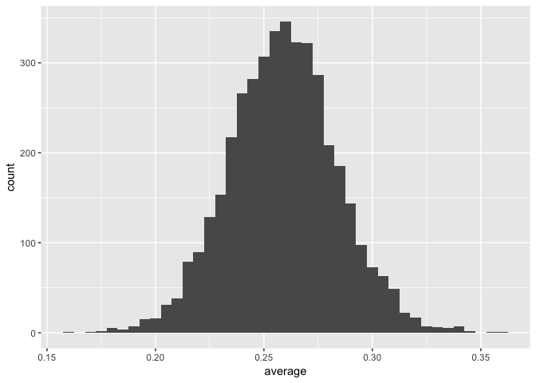
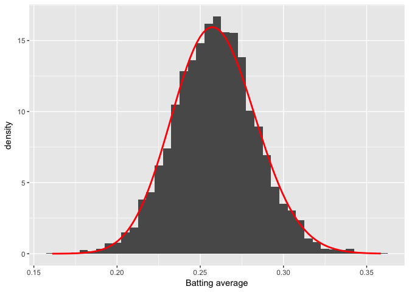
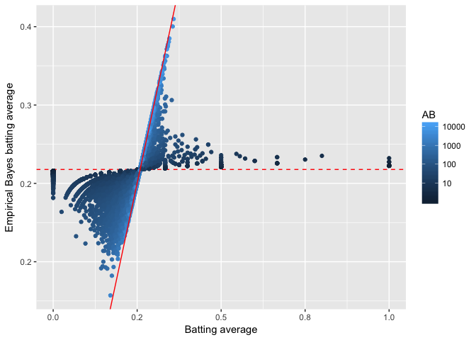
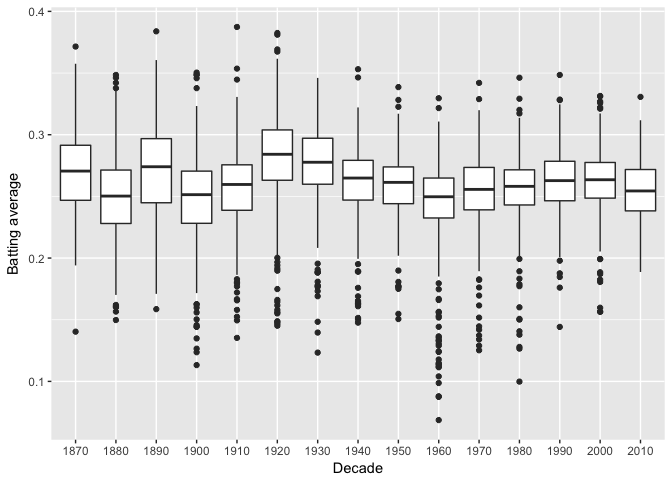

This post and the following posts are a simplification of a series of posts by [David Robinson](http://varianceexplained.org/r/empirical_bayes_baseball/)

Empirical Bayes estimation - a very useful statistical method for estimating a large number of proportions

Which of these two proportions is higher?
  - 4/10
  - 300/1000
  
4/10 has a higher proportion but not a lot of evidence, but 300/1000 has a lower proportion but a lot more evidence.

When you work with pairs of successes/totals like this, you tend to get tripped up by the uncertainty in low counts. 1/21/2 does not mean the same thing as 50/10050/100; nor does 0/10/1 mean the same thing as 0/1000.

Using beta distribution you can:
  - Represent prior expectations
  - Update them based on new evidence

The related method of empirical Bayes estimation used beta distribution to improve a large set of estimates. What's great about this method is that as long as you have a lot of examples, you don't need to bring in prior expectations.

Applying empirical Bayes to estimation of the baseball dataset with the aim of improving our estimate of each player's batting average.


```r
library(dplyr)
```

```
## 
## Attaching package: 'dplyr'
```

```
## The following objects are masked from 'package:stats':
## 
##     filter, lag
```

```
## The following objects are masked from 'package:base':
## 
##     intersect, setdiff, setequal, union
```

```r
library(tidyr)
library(Lahman)

career <- Batting %>%
  filter(AB > 0) %>%
  anti_join(Pitching, by = "playerID") %>%
  group_by(playerID) %>%
  summarize(H = sum(H), AB = sum(AB)) %>%
  mutate(average = H / AB)

# use names along with the player IDs
career <- Master %>%
  tbl_df() %>%
  select(playerID, nameFirst, nameLast) %>%
  unite(name, nameFirst, nameLast, sep = " ") %>%
  inner_join(career, by = "playerID") %>%
  select(-playerID)
```


```r
head(career)
```

```
## # A tibble: 6 x 4
##   name               H    AB average
##   <chr>          <int> <int>   <dbl>
## 1 Hank Aaron      3771 12364  0.305 
## 2 Tommie Aaron     216   944  0.229 
## 3 Andy Abad          2    21  0.0952
## 4 John Abadie       11    49  0.224 
## 5 Ed Abbaticchio   772  3044  0.254 
## 6 Fred Abbott      107   513  0.209
```

Code does:
- removes weakest pitchers
- summarise each  player across all years
- career hits == H
- At Bats == AB

Top batters in history are (ones with highests batting average):


```r
library(knitr)
career %>%
  arrange(desc(average)) %>%
  head(5) %>%
  kable()
```


name                 H   AB   average
-----------------  ---  ---  --------
Jeff Banister        1    1         1
Doc Bass             1    1         1
Steve Biras          2    2         1
C. B. Burns          1    1         1
Jackie Gallagher     1    1         1

These batters are the one's with the highest batting average, but have only been up once or twice. Not really enough evidence

What about the worst?


```r
career %>%
  arrange(average) %>%
  head(5) %>%
  kable()
```


name                  H   AB   average
------------------  ---  ---  --------
Frank Abercrombie     0    4         0
Lane Adams            0    3         0
Horace Allen          0    7         0
Pete Allen            0    4         0
Walter Alston         0    1         0

Not really the worst batters, they may have just been unlucky... still not enough evidence

Average is not a good estimate here. Let's make a better one.

## Step 1: Estimate a prior from all your data

Let's look at batting distribution of all players

```r
library(ggplot2)
career %>%
    filter(AB >= 500) %>%
    ggplot(aes(average)) +
    geom_histogram(binwidth = .005)
```

<!-- -->

In this case, players with AB < 500 were removed. This will result in a better estimate by removing noisy cases

The first step of empirical Bayes estimation is to estimate a beta prior using this data.

So far, a beta distribution looks like a pretty appropriate choice based on the above histogram. A good choice because:
- single peaks
- Multiple peaks would mean multiple betas or a more complicated model

We can then fit the model with this equation:
$$X\sim\mbox{Beta}(\alpha_0,\beta_0)$$

We just need to pick $$\alpha_0$$ and $$\beta_0$$, which we call "hyper-parameters" of our model. Many ways of fitting a probability distribution to data (`optim`, `mle`, `bbmle` etc.)


```r
# just like the graph, we have to filter for the players we actually
# have a decent estimate of
career_filtered <- career %>%
    filter(AB >= 500)

m <- MASS::fitdistr(career_filtered$average, dbeta,
                    start = list(shape1 = 1, shape2 = 10))
```

```
## Warning in densfun(x, parm[1], parm[2], ...): NaNs produced

## Warning in densfun(x, parm[1], parm[2], ...): NaNs produced

## Warning in densfun(x, parm[1], parm[2], ...): NaNs produced
```

```r
alpha0 <- m$estimate[1]
beta0 <- m$estimate[2]
```

This comes up with $$\alpha_0=r alpha0$$ and $$\beta_0=r beta0$$ (your answer may be slightly different). How well does this fit the data?


```r
ggplot(career_filtered) +
  geom_histogram(aes(average, y = ..density..), binwidth = .005) +
  stat_function(fun = function(x) dbeta(x, alpha0, beta0), color = "red",
                size = 1) +
  xlab("Batting average")
```

<!-- -->

Nice!

## Step 2: Use that distribution as a prior for each individual estimate

Now when we look at any individual to estimate their batting average:
- start with overall prior
- update based on previous evidence (covered in post 01)
- it's as simple as adding $$\alpha_0$$ to the number of hits, and $$\alpha_0 + \beta_0$$ to the total number of at-bats.

$$\frac{300+\alpha_0}{1000+\alpha_0+\beta_0}=\frac{300+r round(alpha0, 1)}{1000+r round(alpha0, 1)+r round(beta0, 1)}=r (300 + alpha0) / (1000 + alpha0 + beta0)$$

How about the batter who went up only 10 times, and got 4 hits. We would estimate his batting average as:

$$\frac{4+\alpha_0}{10+\alpha_0+\beta_0}=\frac{4+r round(alpha0, 1)}{10+r round(alpha0, 1)+r round(beta0, 1)}=r (4 + alpha0) / (10 + alpha0 + beta0)$$

Thus, even though $$\frac{4}{10}>\frac{300}{1000}$$, we would guess that the $$\frac{300}{1000}$$ batter is better than the $$\frac{4}{10}$$ batter!

Performing this calculation for all the batters is simple enough:

```r
career_eb <- career %>%
    mutate(eb_estimate = (H + alpha0) / (AB + alpha0 + beta0))
career_eb
```

```
## # A tibble: 9,509 x 5
##    name                  H    AB average eb_estimate
##    <chr>             <int> <int>   <dbl>       <dbl>
##  1 Hank Aaron         3771 12364  0.305        0.304
##  2 Tommie Aaron        216   944  0.229        0.236
##  3 Andy Abad             2    21  0.0952       0.248
##  4 John Abadie          11    49  0.224        0.254
##  5 Ed Abbaticchio      772  3044  0.254        0.254
##  6 Fred Abbott         107   513  0.209        0.227
##  7 Jeff Abbott         157   596  0.263        0.262
##  8 Kurt Abbott         523  2044  0.256        0.256
##  9 Ody Abbott           13    70  0.186        0.245
## 10 Frank Abercrombie     0     4  0            0.256
## # ... with 9,499 more rows
```

## Results

Now we can ask: who are the best batters by this improved estimate?


```r
options(digits = 3)
career_eb %>%
  arrange(desc(eb_estimate)) %>%
  head(5) %>%
  kable()
```


name                       H     AB   average   eb_estimate
---------------------  -----  -----  --------  ------------
Rogers Hornsby          2930   8173     0.358         0.355
Shoeless Joe Jackson    1772   4981     0.356         0.350
Ed Delahanty            2596   7505     0.346         0.342
Billy Hamilton          2158   6268     0.344         0.340
Harry Heilmann          2660   7787     0.342         0.338

```r
options(digits = 1)
```
Who are the worst batters?


```r
options(digits = 3)
career_eb %>%
  arrange(eb_estimate) %>%
  head(5) %>%
  kable()
```


name                H     AB   average   eb_estimate
---------------  ----  -----  --------  ------------
Bill Bergen       516   3028     0.170         0.179
Ray Oyler         221   1265     0.175         0.191
John Vukovich      90    559     0.161         0.196
John Humphries     52    364     0.143         0.196
George Baker       74    474     0.156         0.196

```r
options(digits = 1)
```

In these cases empirical Bayes didn't pick batters with 1 or 2 at-bats. It found players who batted well, or poorly across a long career.  we can start using these empirical Bayes estimates in downstream analyses and algorithms, and not worry that we're accidentally letting $$0/1$$ or $$1/1$$ cases ruin everything.

Overall, let's see how empirical Bayes changed all of the batting average estimates:

```r
ggplot(career_eb, aes(average, eb_estimate, color = AB)) +
  geom_hline(yintercept = alpha0 / (alpha0 + beta0), color = "red", lty = 2) +
  geom_point() +
  geom_abline(color = "red") +
  scale_colour_gradient(trans = "log", breaks = 10 ^ (1:5)) +
  xlab("Batting average") +
  ylab("Empirical Bayes batting average")
```

<!-- -->
The horizontal dashed red line marks $$y=\frac{\alpha_0}{\alpha_0 + \beta_0}=r sprintf("%.3f", alpha0 / (alpha0 + beta0))$$- that's what we would guess someone's batting average was if we had no evidence at all. Notice that points above that line tend to move down towards it, while points below it move up.

The diagonal red line marks $$x=y$$. Points that lie close to it are the ones that didn't get shrunk at all by empirical Bayes. Notice that they're the ones with the highest number of at-bats and hence, more evidence (the brightest blue): they have enough evidence that we're willing to believe the naive batting average estimate.

This is why this process is sometimes called shrinkage: we've moved all our estimates towards the average. How much it moves these estimates depends on how much evidence we have: if we have very little evidence (4 hits out of 10) we move it a lot, if we have a lot of evidence (300 hits out of 1000) we move it only a little. That's shrinkage in a nutshell: Extraordinary outliers require extraordinary evidence.

## Conclusion

Step 1 can be done once, "offline"- analyze all your data and come up with some estimates of your overall distribution. Step 2 is done for each new observation you're considering. You might be estimating the success of a post or an ad, or classifying the behavior of a user in terms of how often they make a particular choice.

And because we're using the beta and the binomial, consider how easy that second step is. All we did was add one number to the successes, and add another number to the total. You can build that into your production system with a single line of code that takes nanoseconds to run.

## Appendix: How could we make this more complicated?

We've made some enormous simplifications in this post.

we assumed all batting averages are drawn from a single distribution. This depends on known factors like the distribution of batting changing over time:


```r
batting_by_decade <- Batting %>%
  filter(AB > 0) %>%
  group_by(playerID, Decade = round(yearID - 5, -1)) %>%
  summarize(H = sum(H), AB = sum(AB)) %>%
  ungroup() %>%
  filter(AB > 500) %>%
  mutate(average = H / AB)

ggplot(batting_by_decade, aes(factor(Decade), average)) +
  geom_boxplot() +
  xlab("Decade") +
  ylab("Batting average")
```

<!-- -->

- Ideally, we'd want to estimate a different Beta prior for each decade
- Similarly, we could estimate separate priors for each team
- a separate prior for pitchers, and so on.

One useful approach to this is Bayesian hierarchical modeling (as used in, for example, this study of SAT scores across different schools).

Also, as alluded to above, we shouldn't be estimating the distribution of batting averages using only the ones with more than 500 at-bats. Really, we should use all of our data to estimate the distribution, but give more consideration to the players with a higher number of at-bats. This can be done by fitting a beta-binomial distribution. For instance, we can use the dbetabinom.ab function from VGAM, and the mle function:


```r
library(VGAM)
```

```
## Loading required package: stats4
```

```
## Loading required package: splines
```

```
## 
## Attaching package: 'VGAM'
```

```
## The following object is masked from 'package:tidyr':
## 
##     fill
```

```r
# negative log likelihood of data given alpha; beta
ll <- function(alpha, beta) {
  -sum(dbetabinom.ab(career$H, career$AB, alpha, beta, log = TRUE))
}

m <- mle(ll, start = list(alpha = 1, beta = 10), method = "L-BFGS-B")
coef(m)
```

```
## alpha  beta 
##    75   224
```

We end up getting almost the same prior, which is reassuring!

