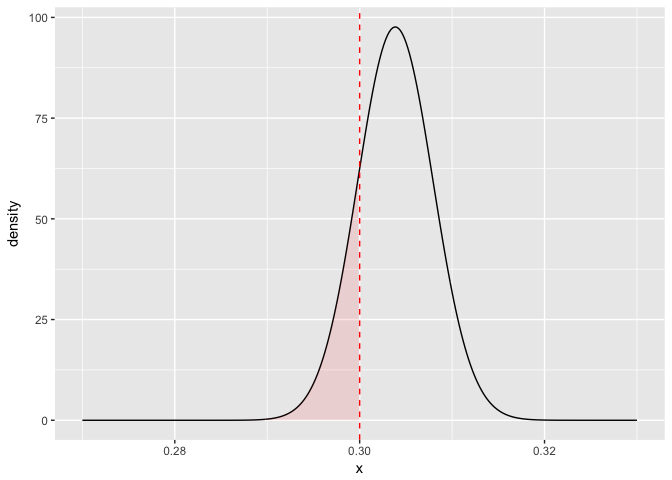
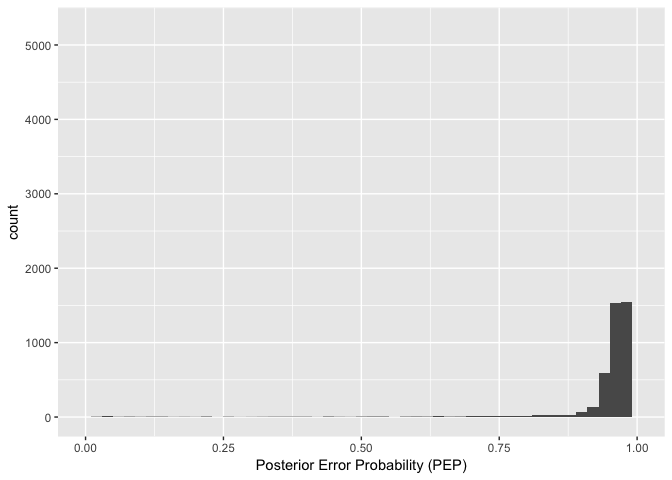
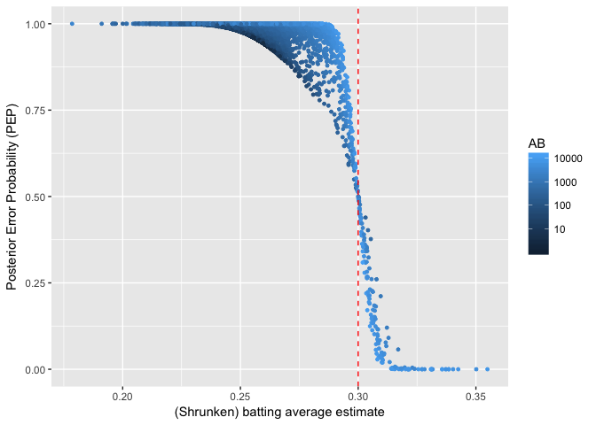
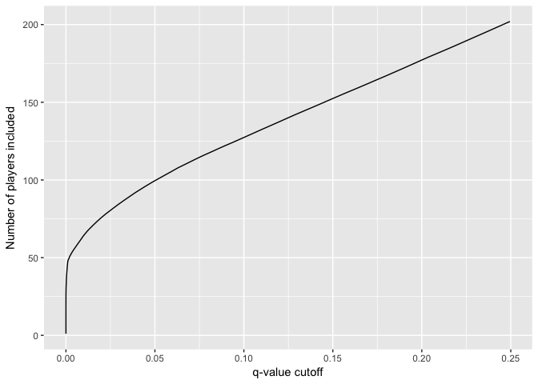

This post and the following posts are a simplification of a series of posts by [David Robinson](http://varianceexplained.org/r/bayesian_fdr_baseball/)

- Rather than estimating a value (like in previous examples), we’re looking to answer a yes or no question about each hypothesis, and thus classify them into two groups
- e.g. constructing a batting hall of fame, where all batters included have a batting probability > 0.300. 
- We need a principled approach to decide which players are worth including, that also handles multiple testing problems. (Are we sure that any players actually have a batting probability above .300? Or did a few players just get lucky?) To solve this, we’re going to apply a Bayesian approach to a method usually associated with frequentist statistics, namely false discovery rate control.


```r
# CODE SETUP
library(dplyr)
library(tidyr)
library(Lahman)

career <- Batting %>%
  filter(AB > 0) %>%
  anti_join(Pitching, by = "playerID") %>%
  group_by(playerID) %>%
  summarize(H = sum(H), AB = sum(AB)) %>%
  mutate(average = H / AB)

career <- Master %>%
  tbl_df() %>%
  select(playerID, nameFirst, nameLast) %>%
  unite(name, nameFirst, nameLast, sep = " ") %>%
  inner_join(career, by = "playerID")

career_filtered <- career %>% filter(AB >= 500)

m <- MASS::fitdistr(career_filtered$average, dbeta,
                    start = list(shape1 = 1, shape2 = 10))

alpha0 <- m$estimate[1]
beta0 <- m$estimate[2]

career_eb <- career %>%
    mutate(eb_estimate = (H + alpha0) / (AB + alpha0 + beta0)) %>%
    mutate(alpha1 = H + alpha0,
           beta1 = AB - H + beta0)
```

## Posterior Error Probabilities


```r
hank_aaron <- career_eb %>%
    filter(name == "Hank Aaron")

hank_aaron_average <- hank_aaron$eb_estimate
```


```r
hank_aaron$average
```

```
## [1] 0.3049984
```
- Hank Arron has a true probability of hitting the ball at 0.305, should we still include him?


```r
hank_aaron_average
```

```
## [1] 0.3038849
```
- His eb (empirical bayes) estimate suggests that his probability of hitting the ball is > 0.300. But we're still not certain (recall credible intervals). Let's look at his posterior beta distribution:


```r
library(ggplot2)
career_eb %>%
    filter(name == "Hank Aaron") %>%
    do(data_frame(x = seq(.27, .33, .0002),
                  density = dbeta(x, .$alpha1, .$beta1))) %>%
    ggplot(aes(x, density)) +
    geom_line() +
    geom_ribbon(aes(ymin = 0, ymax = density * (x < .3)),
                alpha = .1, fill = "red") +
    geom_vline(color = "red", lty = 2, xintercept = .3)
```

<!-- -->

- nonzero shaded area that his true probability of hitting is less than 0.3
- We can calculate this with the cumulative distribution function (CDF) of the beta distribution, computed by pbeta in R:


```r
career_eb %>% filter(name == "Hank Aaron")
```

```
## # A tibble: 1 x 8
##   playerID  name           H    AB average eb_estimate alpha1 beta1
##   <chr>     <chr>      <int> <int>   <dbl>       <dbl>  <dbl> <dbl>
## 1 aaronha01 Hank Aaron  3771 12364   0.305       0.304   3850  8820
```

```r
pbeta(.3, 3850, 8818)
```

```
## [1] 0.1690514
```

- The probability that he doesn't belong in the hall of fame is called the *posterior error probability* or *PEP*
- The probability that he does belong is called the *Posterior Inclusion Probability* or *PIP*
- PIP = 1 - PEP
- PEP chosed over PIP in this case will become clearer in the next section

- Calculate PEP for every player:

```r
career_eb <- career_eb %>%
    mutate(PEP = pbeta(.3, alpha1, beta1))
```

- What does the distribution of PEP look like across players?

```r
ggplot(career_eb, aes(PEP)) +
    geom_histogram(binwidth = .02) +
    xlab("Posterior Error Probability (PEP)") +
    xlim(0, 1)
```

<!-- -->
*(Note: There should be a bar at 1.0 reaching 5000, but not rendering)*

- Unsurprisingly, most players don't belong in the hall of fame
- If they were included it would most certainly be in error!
- In the middle are the borderline players: the ones where we’re not sure
- And down there close to 0 are the rare but proud players who we’re (almost) certain belong in the hall of fame.

- The PEP is closely related to the estimated batting average:

```r
career_eb %>%
    ggplot(aes(eb_estimate, PEP, color = AB)) +
    geom_point(size = 1) +
    xlab("(Shrunken) batting average estimate") +
    ylab("Posterior Error Probability (PEP)") +
    geom_vline(color = "red", lty = 2, xintercept = .3) +
    scale_colour_gradient(trans = "log", breaks = 10 ^ (1:5))
```

<!-- -->

- *Notice that crossover point: to have a PEP less than 50%, you need to have a shrunken batting average greater than .3.*
- That’s because the shrunken estimate is the center of our posterior beta distribution (the “over/under” point)
- If a player’s shrunken estimate is above .3, it’s more likely than not that their true average is as well
- And the players we’re not sure about (PEP ≈≈ .5) have batting averages very close to .300.

- Notice also the relationship between the number of at-bats (the amount of evidence) and the PEP
- If a player’s shrunken batting average is .28, but he hasn’t batted many times, it is still possible his true batting average is above .3- the credible interval is wide
- However, if the player with .28 has a high AB (light blue), the credible interval becomes thinner, we become confident that the true probability of hitting is under .3, and the PEP goes up to 1.

## False Discovery Rate

- Now we want to set some threshold for inclusion in our Hall of Fame.
- *let’s try to include as many players as possible, while ensuring that no more than 5% of the Hall of Fame was mistakenly included or we want to ensure that if you’re in the Hall of Fame, the probability you belong there is at least 95%*
- This criterion is called *false discovery rate control*


```r
by_PEP <- career_eb %>%
    arrange(PEP) %>%
    mutate(rank = row_number()) %>%
    select(rank, name, H, AB, eb_estimate, PEP)

by_PEP %>%
    head(10) %>%
    knitr::kable()
```


 rank  name                       H     AB   eb_estimate   PEP
-----  ---------------------  -----  -----  ------------  ----
    1  Rogers Hornsby          2930   8173     0.3549035     0
    2  Ed Delahanty            2596   7505     0.3424947     0
    3  Shoeless Joe Jackson    1772   4981     0.3501469     0
    4  Willie Keeler           2932   8591     0.3384540     0
    5  Nap Lajoie              3242   9589     0.3356468     0
    6  Tony Gwynn              3141   9288     0.3356499     0
    7  Harry Heilmann          2660   7787     0.3384685     0
    8  Lou Gehrig              2721   8001     0.3370922     0
    9  Billy Hamilton          2158   6268     0.3403142     0
   10  Eddie Collins           3315   9949     0.3309824     0
- These guys are no brainers and guranteed entry
- What do the 90th-100th players look like?


```r
by_PEP %>%
    slice(90:100) %>%
    knitr::kable()
```


 rank  name                 H      AB   eb_estimate         PEP
-----  ---------------  -----  ------  ------------  ----------
   90  Joe Mauer         1826    5919     0.3060597   0.1497000
   91  Denny Lyons       1333    4294     0.3070048   0.1514419
   92  Don Mattingly     2153    7003     0.3054073   0.1577535
   93  Taffy Wright      1115    3583     0.3070769   0.1694417
   94  Hank Aaron        3771   12364     0.3038849   0.1709227
   95  John Stone        1391    4494     0.3062962   0.1720956
   96  Ed Morgan          879    2810     0.3075167   0.1818344
   97  Jose Altuve       1046    3361     0.3068508   0.1844164
   98  George Burns      2018    6573     0.3048731   0.1901962
   99  Robinson Cano     2210    7210     0.3045798   0.1943786
  100  Home Run Baker    1838    5984     0.3048047   0.2042088

- These are borderline
- let’s say we chose to take the top 100 players for our Hall of Fame (thus, cut it off at Ed Morgan). What would we predict the false discovery rate to be? That is, what fraction of these 100 players would be falsely included?


```r
top_players <- career_eb %>%
    arrange(PEP) %>%
    head(100)
```

- Well, we know the PEP of each of these 100 players, which is the probability that that individual player is a false positive
- And by the wonderful property of *linearity of expected value*, we can just add up these probabilities to get the expected value (the average) of the total number of false positives.
- Explanation of [Linearity of the Expectation](https://www.quora.com/What-is-an-intuitive-explanation-for-the-linearity-of-expectation-Intuitively-it-just-throws-me-off-to-think-that-E-X+Y-E-X-+-E-Y-even-if-X-and-Y-are-not-independent)


```r
sum(top_players$PEP)
```

```
## [1] 5.07326
```

- This means that of these 100 players, we expect that about 5 of them are false discoveries.
- Now, we don’t know which players we are mistaken about! 
- But we can make predictions about the players in aggregate
- Here, we can see that taking the top 100 players would get pretty close to our goal of FDR = 5%.
- Note that we’re calculating the FDR as 5.07/100=5.507%. Thus, we’re really computing the mean PEP: the average Posterior Error Probability.


```r
mean(top_players$PEP)
```

```
## [1] 0.0507326
```

- We could have asked the same thing about the first 50 players, or the first 200:


```r
sorted_PEP <- career_eb %>%
    arrange(PEP)

mean(head(sorted_PEP$PEP, 50))
```

```
## [1] 0.001862754
```


```r
mean(head(sorted_PEP$PEP, 200))
```

```
## [1] 0.2456174
```

- We can experiment with many thresholds to get our desired FDR
- but it’s even easier just to compute them all at once, by computing the cumulative mean of all the (sorted) posterior error probabilities
- We can use the cummean function from dplyr:


```r
career_eb <- career_eb %>%
    arrange(PEP) %>%
    mutate(qvalue = cummean(PEP))
```

## Q - Values

- Notice that I called the cumulative mean of the FDR a qvalue
- The term q-value was first defined by John Storey as an analogue to the p-value for controlling FDRs in multiple testing.
- The q-value is convenient because we can say “to control the FDR at X%, collect only hypotheses where q < X”


```r
hall_of_fame <- career_eb %>%
    filter(qvalue < .05)
nrow(hall_of_fame)
```

```
## [1] 99
```
- This ends up with 99 players in the Hall of Fame.
- If we wanted to be more careful about letting players in, we’d simply set a stricter q-value threshold:


```r
strict_hall_of_fame <- career_eb %>%
    filter(qvalue < .01)
nrow(strict_hall_of_fame)
```

```
## [1] 64
```

- At which point we’d include only 64 players.
- It’s useful to look at how many players would be included at various thresholds:


```r
career_eb %>%
    filter(qvalue < .25) %>%
    ggplot(aes(qvalue, rank(PEP))) +
    geom_line() +
    xlab("q-value cutoff") +
    ylab("Number of players included")
```

<!-- -->

- This shows that you could include 200 players in the Hall of Fame, but at that point you’d expect that about 25% of them would be incorrectly included
- On the other side, you could create a hall of 50 players and be very confident that all of them have a batting probability of .300.

- It’s worth emphasizing the difference between measuring an individual’s posterior error probability and the q-value, which is the false discovery rate of a group including that player
- Hank Aaron has a PEP of 17%, but he can be included in the Hall of Fame while keeping the FDR below 5%.
- If this is surprising, imagine that you were instead trying to keep the average height above 6’0”. You would start by including all players taller than 6’0”, but could also include some players who were 5’10” or 5’11” while preserving your average.
- Similarly, we simply need to keep the average PEP of the players below 5%. (For this reason, the PEP is sometimes called the *local false discovery rate*, which emphasizes both the connection and the distinction).
