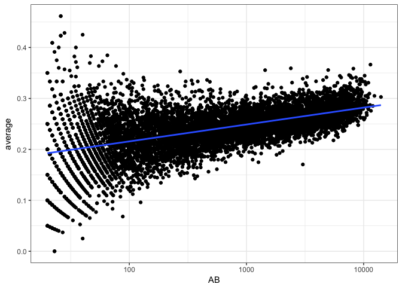
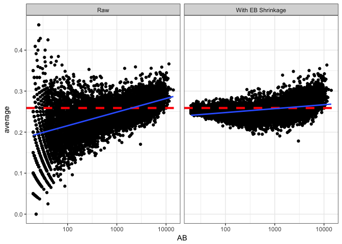
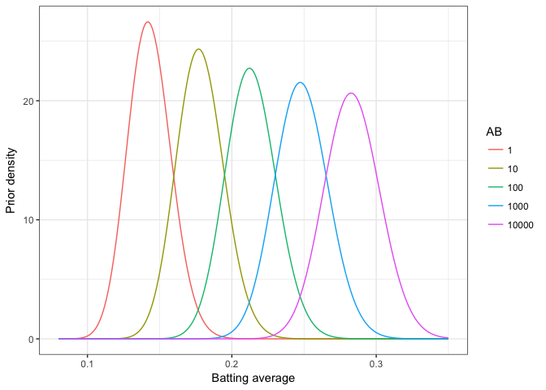
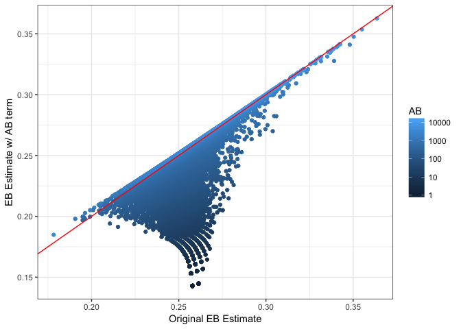
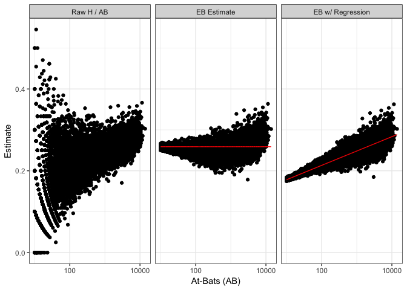

This post and the following posts are a simplification of a series of posts by [David Robinson](http://varianceexplained.org/r/beta_binomial_baseball/)

Empirical Bayes is useful here because when we don’t have a lot of information about a batter, they’re “shrunken” towards the average across all players, as a natural consequence of the beta prior.

But there’s a complication with this approach. When players are better, they are given more chances to bat. That means there’s a relationship between the number of at-bats (AB) and the true batting average. For reasons  explained below, this makes our estimates systematically inaccurate.

We change our model where all batters have the same prior to one where each batter has his own prior, using a method called beta-binomial regression.

## Setup


```r
library(dplyr)
```

```
## 
## Attaching package: 'dplyr'
```

```
## The following objects are masked from 'package:stats':
## 
##     filter, lag
```

```
## The following objects are masked from 'package:base':
## 
##     intersect, setdiff, setequal, union
```

```r
library(tidyr)
library(Lahman)
library(ggplot2)
theme_set(theme_bw())

# Grab career batting average of non-pitchers
# (allow players that have pitched <= 3 games, like Ty Cobb)
pitchers <- Pitching %>%
  group_by(playerID) %>%
  summarize(gamesPitched = sum(G)) %>%
  filter(gamesPitched > 3)

career <- Batting %>%
  filter(AB > 0) %>%
  anti_join(pitchers, by = "playerID") %>%
  group_by(playerID) %>%
  summarize(H = sum(H), AB = sum(AB)) %>%
  mutate(average = H / AB)

# Add player names
career <- Master %>%
  tbl_df() %>%
  dplyr::select(playerID, nameFirst, nameLast) %>%
  unite(name, nameFirst, nameLast, sep = " ") %>%
  inner_join(career, by = "playerID")

# Estimate hyperparameters alpha0 and beta0 for empirical Bayes
career_filtered <- career %>% filter(AB >= 500)
m <- MASS::fitdistr(career_filtered$average, dbeta,
                    start = list(shape1 = 1, shape2 = 10))
```

```
## Warning in densfun(x, parm[1], parm[2], ...): NaNs produced

## Warning in densfun(x, parm[1], parm[2], ...): NaNs produced

## Warning in densfun(x, parm[1], parm[2], ...): NaNs produced
```

```r
alpha0 <- m$estimate[1]
beta0 <- m$estimate[2]
prior_mu <- alpha0 / (alpha0 + beta0)

# For each player, update the beta prior based on the evidence
# to get posterior parameters alpha1 and beta1
career_eb <- career %>%
  mutate(eb_estimate = (H + alpha0) / (AB + alpha0 + beta0)) %>%
  mutate(alpha1 = H + alpha0,
         beta1 = AB - H + beta0) %>%
  arrange(desc(eb_estimate))
```

Recall that the eb_estimate column gives us estimates about each player's batting average, estimated from a combination of each player's record with the beta prior parameters estimated from everyone ($\alpha_0$, $\beta_0$). For example, a player with only a single at-bat and a single hit ($H = 1; AB = 1; H / AB = 1$) will have an empirical Bayes estimate of

$$(H + \alpha_0) / (AB + \alpha_0 + \beta_0) = (1 + 76.5) / (1+76.5+218.6) = 0.262$$

Now, here’s the complication. Let’s compare at-bats (on a log scale) to the raw batting average:


```r
career %>%
  filter(AB >= 20) %>%
  ggplot(aes(AB, average)) +
  geom_point() +
  geom_smooth(method = "lm", se = FALSE) +
  scale_x_log10()
```

<!-- -->

- We notice that batters with low ABs have more variance in our estimates- that’s a familiar pattern because we have less information about them
- as the number of at-bats increases, the batting average also increases (the result of the choices of baseball managers, better batters are more likely to bat)
- Other factors are also correlated with a player’s batting average (year, position, team, etc)
- But this one is particularly important, because it confounds our ability to perform empirical Bayes estimation


```r
career_eb %>%
  filter(AB >= 20) %>%
  gather(type, value, average, eb_estimate) %>%
  mutate(type = plyr::revalue(type, c(average = "Raw",
                                      eb_estimate = "With EB Shrinkage"))) %>%
  ggplot(aes(AB, value)) +
  geom_point() +
  scale_x_log10() +
  geom_hline(color = "red", lty = 2, size = 1.5, yintercept = prior_mu) +
  facet_wrap(~type) +
  ylab("average") +
    geom_smooth(method = "lm")
```

<!-- -->


```r
median_lt_20 <- career_eb %>%
  filter(AB >= 10, AB <= 20) %>%
  summarize(average = median(H / AB))
median_lt_20
```

```
## # A tibble: 1 x 1
##   average
##     <dbl>
## 1   0.167
```

That horizontal red line shows the prior mean that we're "shrinking" towards ($\frac{\alpha_0}{\alpha_0 + \beta_0} = r prior_mu$). Notice that it is too high for the low-AB players.

For example, the median batting average for players with 5-20 at-bats is 0.167 and they get shrunk way towards the overall average! The high-AB crowd basically stays where they are, because each has a lot of evidence.

*So since low-AB batters are getting overestimated, and high-AB batters are staying where they are, we're working with a biased estimate that is systematically overestimating batter ability*

## Accounting for AB in the model

We'll need to have AB somehow influence our priors, particularly affecting the mean batting average. In particular, we want the typical batting average to be linearly affected by $\log(\mbox{AB})$.

First we should write out what our current model is, in the form of a generative process, in terms of how each of our variables is generated from particular distributions. Defining $p_i$ to be the true probability of hitting for batter $i$ (that is, the "true average" we're trying to estimate), we're assuming

$p_i \sim \mbox{Beta}(\alpha_0, \beta_0)$

$H_i \sim \mbox{Binom}(\mbox{AB}_i, p_i)$

(We're letting the totals $\mbox{AB}_i$ be fixed and known per player). We made up this model in one of the first posts in this series and have been using it since.

I'll point out that there's another way to write the $p_i$ calculation, by re-parameterizing the beta distribution. Instead of parameters $\alpha_0$ and $\beta_0$, let's write it in terms of $\mu_0$ and $\sigma_0$:

$$p_i \sim \mbox{Beta}(\mu_0 / \sigma_0, (1 - \mu_0) / \sigma_0)$$

Here, $\mu_0$ represents the mean batting average, while $\sigma$ represents how spread out the distribution is (note that $\sigma = \frac{1}{\alpha+\beta}$). When $\sigma$ is high, the beta distribution is very wide (a less informative prior), and when $\sigma$ is low, it's narrow (a more informative prior). Way back in my first post about the beta distribution, this is basically how I chose parameters: I wanted $\mu = .27$, and then I chose a $\sigma$ that would give the desired distribution that mostly lay between .210 and .350, our expected range of batting averages.

Now that we've written our model in terms of $\mu$ and $\sigma$, it becomes easier to see how a model could take AB into consideration. We simply define $\mu$ so that it includes $\log(\mbox{AB})$ as a linear term:

$$\mu_i = \mu_0 + \mu_{\mbox{AB}} \cdot \log(\mbox{AB})$$

$$\alpha_{0,i} = \mu_i / \sigma_0$$

$$\beta_{0,i} = (1 - \mu_i) / \sigma_0$$

Then we define the batting average $p_i$ and the observed $H_i$ just like before:

$$p_i \sim \mbox{Beta}(\alpha_{0,i}, \beta_{0,i})$$

$$H_i \sim \mbox{Binom}(\mbox{AB}_i, p_i)$$

This particular model is called beta-binomial regression. We already had each player represented with a binomial whose parameter was drawn from a beta, but now we're allowing the expected value of the beta to be influenced.

## Step 1: Fit the model across all players

Going back to the basics of empirical Bayes, our first step is to fit these prior parameters: $\mu_0$, $\mu_{\mbox{AB}}$, $\sigma_0$. When doing so, it's ok to momentarily "forget" we're Bayesians- we picked our $\alpha_0$ and $\beta_0$ using maximum likelihood, so it's OK to fit these using a maximum likelihood approach as well. You can use the gamlss package for fitting beta-binomial regression using maximum likelihood.


```r
library(gamlss)
```

```
## Loading required package: splines
```

```
## Loading required package: gamlss.data
```

```
## Loading required package: gamlss.dist
```

```
## Loading required package: MASS
```

```
## 
## Attaching package: 'MASS'
```

```
## The following object is masked from 'package:dplyr':
## 
##     select
```

```
## Loading required package: nlme
```

```
## 
## Attaching package: 'nlme'
```

```
## The following object is masked from 'package:dplyr':
## 
##     collapse
```

```
## Loading required package: parallel
```

```
##  **********   GAMLSS Version 5.0-6  **********
```

```
## For more on GAMLSS look at http://www.gamlss.org/
```

```
## Type gamlssNews() to see new features/changes/bug fixes.
```

```r
fit <- gamlss(cbind(H, AB - H) ~ log(AB),
              data = career_eb,
              family = BB(mu.link = "identity"))
```

```
## GAMLSS-RS iteration 1: Global Deviance = 99280.41 
## GAMLSS-RS iteration 2: Global Deviance = 78876.96 
## GAMLSS-RS iteration 3: Global Deviance = 74481.56 
## GAMLSS-RS iteration 4: Global Deviance = 74474.72 
## GAMLSS-RS iteration 5: Global Deviance = 74474.72
```

We can pull out the coefficients with the broom package


```r
library(broom)

td <- tidy(fit)
td
```

```
##   parameter        term    estimate    std.error  statistic p.value
## 1        mu (Intercept)  0.14311929 0.0015586557   91.82226       0
## 2        mu     log(AB)  0.01522737 0.0002127345   71.57921       0
## 3     sigma (Intercept) -6.29815185 0.0228342458 -275.82044       0
```

This gives us our three parameters: $\mu_0 = 0.143$, $\mu_\mbox{AB} = 0.015$, and (since sigma has a log-link) $\sigma_0 = \exp(-6.2982) = exp(0.00184)$.

This means that our new prior beta distribution for a player depends on the value of AB. For example, here are our prior distributions for several values:


```r
mu_0 <- td$estimate[1]
mu_AB <- td$estimate[2]
sigma <- exp(td$estimate[3])

crossing(x = seq(0.08, .35, .001), AB = c(1, 10, 100, 1000, 10000)) %>%
  mutate(density = dbeta(x, (mu_0 + mu_AB * log(AB)) / sigma,
                         (1 - (mu_0 + mu_AB * log(AB))) / sigma)) %>%
  mutate(AB = factor(AB)) %>%
  ggplot(aes(x, density, color = AB, group = AB)) +
  geom_line() +
  xlab("Batting average") +
  ylab("Prior density")
```

<!-- -->

Notice that there is still uncertainty in our prior- a player with 10,000 at-bats could have a batting average ranging from about .22 to .35. But the range of that uncertainty changes greatly depending on the number of at-bats- any player with AB = 10,000 is almost certainly better than one with AB = 10.

## Step 2: Estimate each player’s average using this prior

Now that we've fit our overall model, we repeat our second step of the empirical Bayes method. Instead of using a single $\alpha_0$ and $\beta_0$ values as the prior, we choose the prior for each player based on their AB. We then update using their $H$ and $AB$ just like before.

Here, all we need to calculate are the `mu` (that is, $\mu = \mu_0 + \mu_{\log(\mbox{AB})}$) and `sigma` ($\sigma$) parameters for each person. (Here, `sigma` will be the same for everyone, but that may not be true in more complex models). This can be done using the `fitted` method on the gamlss object:


```r
mu <- fitted(fit, parameter = "mu")
sigma <- fitted(fit, parameter = "sigma")

head(mu)
```

```
##         1         2         3         4         5         6 
## 0.2854091 0.2802964 0.2727557 0.2615864 0.2789980 0.2836626
```


```r
head(sigma)
```

```
##           1           2           3           4           5           6 
## 0.001839702 0.001839702 0.001839702 0.001839702 0.001839702 0.001839702
```


Now we can calculate $\alpha_0$ and $\beta_0$ parameters for each player, according to $\alpha_{0,i}=\mu_i / \sigma_0$ and $\beta_{0,i}=(1-\mu_i) / \sigma_0$. From that, we can update based on $H$ and $AB$ to calculate new $\alpha_{1,i}$ and $\beta_{1,i}$ for each player.


```r
career_eb_wAB <- career_eb %>%
  dplyr::select(name, H, AB, original_eb = eb_estimate) %>%
  mutate(mu = mu,
         alpha0 = mu / sigma,
         beta0 = (1 - mu) / sigma,
         alpha1 = alpha0 + H,
         beta1 = beta0 + AB - H,
         new_eb = alpha1 / (alpha1 + beta1))
```


How does this change our estimates?


```r
ggplot(career_eb_wAB, aes(original_eb, new_eb, color = AB)) +
  geom_point() +
  geom_abline(color = "red") +
  xlab("Original EB Estimate") +
  ylab("EB Estimate w/ AB term") +
  scale_color_continuous(trans = "log", breaks = 10 ^ (0:4))
```

<!-- -->

Notice that relative to the previous empirical Bayes estimate, this one is lower for batters with low AB and about the same for high-AB batters. This fits with our earlier description- we’ve been systematically over-estimating batting averages.

Here’s another way of comparing the estimation methods:


```r
library(tidyr)

lev <- c(raw = "Raw H / AB", original_eb = "EB Estimate", new_eb = "EB w/ Regression")

career_eb_wAB %>%
  filter(AB >= 10) %>%
  mutate(raw = H / AB) %>%
  gather(type, value, raw, original_eb, new_eb) %>%
  mutate(mu = ifelse(type == "original_eb", prior_mu,
                     ifelse(type == "new_eb", mu, NA))) %>%
  mutate(type = factor(plyr::revalue(type, lev), lev)) %>%
  ggplot(aes(AB, value)) +
  geom_point() +
  geom_line(aes(y = mu), color = "red") +
  scale_x_log10() +
  facet_wrap(~type) +
  xlab("At-Bats (AB)") +
  ylab("Estimate")
```

```
## Warning: Removed 8863 rows containing missing values (geom_path).
```

<!-- -->

Notice that we used to shrink batters towards the overall average (red line), but now we are shrinking them towards the overall trend- that red slope

Don’t forget that this change in the posteriors won’t just affect shrunken estimates. It will affect all the ways we’ve used posterior distributions in this series: credible intervals, posterior error probabilities, and A/B comparisons. Improving the model by taking AB into account will help all these results more accurately reflect reality.
