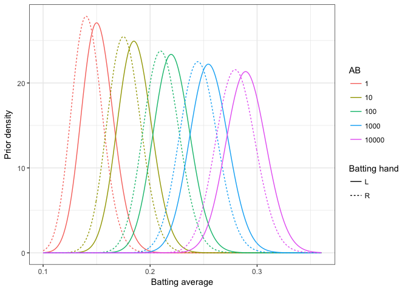
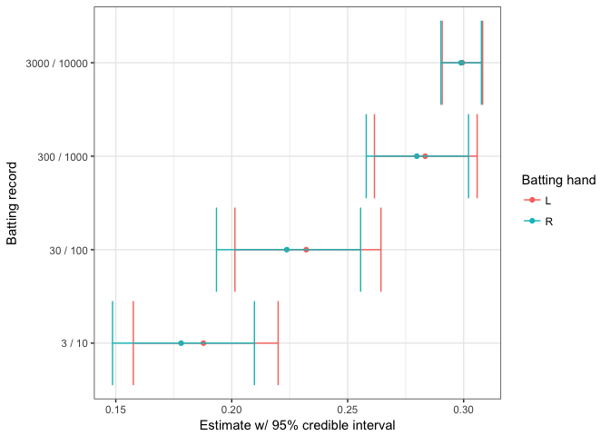
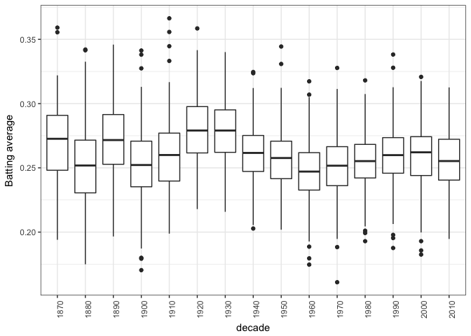
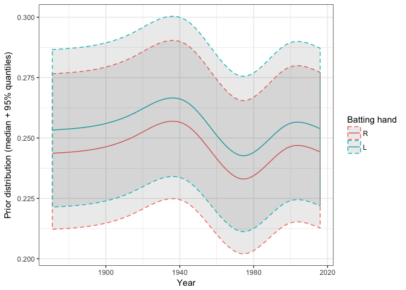
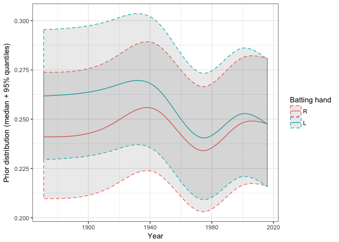
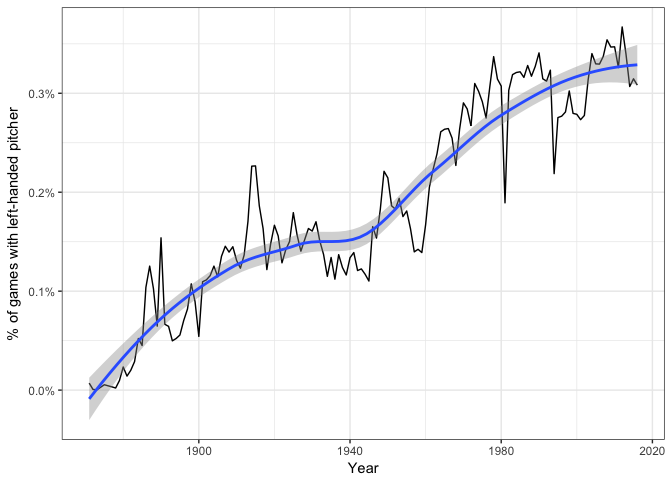
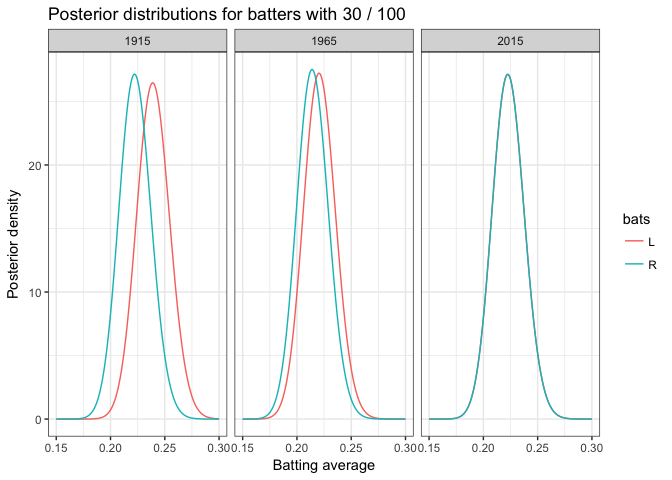

This post and the following posts are a simplification of a series of posts by [David Robinson](http://varianceexplained.org/r/hierarchical_bayes_baseball/)

- Suppose you were a scout hiring a new baseball player, and were choosing between two that have had 100 at-bats each:
  - A left-handed batter who has hit *30 hits / 100 at-bats*
  - A right-handed batter who has hit *30 hits / 100 at-bats*
  
- Who would you guess was the better batter?
  - They both have the same exact batting record...
  - Historically, left-handed batters are slightly better hitters than right-handed?
  - How could you incorporate that evidence?

- Bayesian hierarchical modeling
  - Where the priors for each player are not fixed, but rather depend on other latent variables
  -  In our empirical Bayesian approach to hierarchical modeling, we’ll estimate this prior using beta binomial regression, and then apply it to each batter
  - Useful because, if I were analyzing ad clickthrough rates on a website, I may notice that different countries have different clickthrough rates, and therefore fit different priors for each.

## Setup  

```r
library(gamlss)
library(dplyr)
library(tidyr)
library(Lahman)
library(ggplot2)
theme_set(theme_bw())

# Grab career batting average of non-pitchers
# (allow players that have pitched <= 3 games, like Ty Cobb)
pitchers <- Pitching %>%
  group_by(playerID) %>%
  summarize(gamesPitched = sum(G)) %>%
  filter(gamesPitched > 3)

# in this setup, we're keeping some extra information for later in the post:
# a "bats" column and a "year" column
career <- Batting %>%
  filter(AB > 0) %>%
  anti_join(pitchers, by = "playerID") %>%
  group_by(playerID) %>%
  summarize(H = sum(H), AB = sum(AB), year = mean(yearID)) %>%
  mutate(average = H / AB)

# Add player names
career <- Master %>%
  tbl_df() %>%
  dplyr::select(playerID, nameFirst, nameLast, bats) %>%
  unite(name, nameFirst, nameLast, sep = " ") %>%
  inner_join(career, by = "playerID")
```

- Based on our last post, we perform beta binomial regression using the gamlss package. This fits a model that allows the mean batting average μ to depend on the number of at-bats a player has had.


```r
library(gamlss)

fit <- gamlss(cbind(H, AB - H) ~ log(AB),
              data = dplyr::select(career, -bats),
              family = BB(mu.link = "identity"))
```

```
## GAMLSS-RS iteration 1: Global Deviance = 99280.41 
## GAMLSS-RS iteration 2: Global Deviance = 78876.96 
## GAMLSS-RS iteration 3: Global Deviance = 74481.56 
## GAMLSS-RS iteration 4: Global Deviance = 74474.72 
## GAMLSS-RS iteration 5: Global Deviance = 74474.72
```

- The prior $\alpha_0$ and $\beta_0$ can then be computed for each player based on $\mu$ and a dispersion parameter $\sigma$:


```r
career_eb <- career %>%
  mutate(mu = fitted(fit, "mu"),
         sigma = fitted(fit, "sigma"),
         alpha0 = mu / sigma,
         beta0 = (1 - mu) / sigma,
         alpha1 = alpha0 + H,
         beta1 = beta0 + AB - H,
         estimate = alpha1 / (alpha1 + beta1))
```

- Now we’ve corrected for one confounding factor, ABAB. One important aspect of this prediction is that it won’t be useful when we’ve just hired a “rookie” player, and we’re wondering what his batting average will be
- But there’s some information we can use even at the start of a player’s career. Part of the philosophy of the Bayesian approach is to bring our prior expectations in mathematically. Let’s try doing that with some factors that influence batting success.

## Right- and left- handed batters

- It’s well known in sabermetrics that left-handed batters tend to bat slightly better.
- The Lahman dataset provides that information in the bats column: in the above code, I retained it as part of the career dataset.


```r
career %>%
  count(bats)
```

```
## # A tibble: 4 x 2
##   bats      n
##   <fct> <int>
## 1 B       837
## 2 L      2926
## 3 R      5993
## 4 <NA>    834
```

- These letters represent “Both” (switch hitters), “Left”, and “Right”, respectively
- We also see that there are a number of batters (mostly from earlier in the game’s history) that we don’t have handedness information for. We’ll filter them out of this analysis
- Incorporating this as a predictor is as simple as adding bats to the formula in the gamlss call (our beta-binomial regression):


```r
# relevel to set right-handed batters as the baseline
career2 <- career %>%
  filter(!is.na(bats)) %>%
  mutate(bats = relevel(bats, "R"))

fit2 <- gamlss(cbind(H, AB - H) ~ log(AB) + bats,
               data = career2,
               family = BB(mu.link = "identity"))
```

```
## GAMLSS-RS iteration 1: Global Deviance = 94947.78 
## GAMLSS-RS iteration 2: Global Deviance = 75146.09 
## GAMLSS-RS iteration 3: Global Deviance = 70769.8 
## GAMLSS-RS iteration 4: Global Deviance = 70763.25 
## GAMLSS-RS iteration 5: Global Deviance = 70763.25
```

- We can then look at the coefficients:

```r
library(broom)
tidy(fit2)
```

```
##   parameter        term     estimate    std.error   statistic      p.value
## 1        mu (Intercept)  0.141402838 0.0016069606   87.993967 0.000000e+00
## 2        mu     log(AB)  0.015068209 0.0002168056   69.501021 0.000000e+00
## 3        mu       batsB -0.001331361 0.0009741636   -1.366671 1.717600e-01
## 4        mu       batsL  0.009799834 0.0006264474   15.643506 1.686213e-54
## 5     sigma (Intercept) -6.378237551 0.0230985930 -276.130999 0.000000e+00
```
- According to our beta-binomial regression, there is indeed a statistically significant advantage to being left-handed, with lefties hitting about 1% more often. This may seem like a small effect, but over the course of multiple games it could certainly make a difference.
- In contrast, there’s apparently no detectable advantage to being able to bat with both hands. 

- For our empirical Bayes estimation, this means every combination of handedness and AB now has its own prior:  


```r
sigma <- fitted(fit2, "sigma")[1]

crossing(bats = c("L", "R"),
         AB = c(1, 10, 100, 1000, 10000)) %>%
  augment(fit2, newdata = .) %>%
  rename(mu = .fitted) %>%
  crossing(x = seq(.1, .36, .0005)) %>%
  mutate(alpha = mu / sigma,
         beta = (1 - mu) / sigma,
         density = dbeta(x, alpha, beta)) %>%
  ggplot(aes(x, density, color = factor(AB), lty = bats)) +
  geom_line() +
  labs(x = "Batting average",
       y = "Prior density",
       color = "AB",
       lty = "Batting hand")
```

<!-- -->

- We can use these priors to improve our estimates of each player, by effectively giving a natural advantage to each left-handed batter
- Note that this prior can still easily be overcome by enough evidence
- For example, consider our hypothetical pair of battters from the introduction, where each has a 30% success rate, but where one is left-handed and one right-handed. If the batters had few at-bats, we’d guess that the left-handed batter was better, but the posterior for the two will converge as AB increases:


```r
crossing(bats = c("L", "R"),
         AB = c(10, 100, 1000, 10000)) %>%
  augment(fit2, newdata = .) %>%
  mutate(H = .3 * AB,
         alpha0 = .fitted / sigma,
         beta0 = (1 - .fitted) / sigma,
         alpha1 = alpha0 + H,
         beta1 = beta0 + AB - H,
         estimate = alpha1 / (alpha1 + beta1),
         conf.low = qbeta(.025, alpha1, beta1),
         conf.high = qbeta(.975, alpha1, beta1),
         record = paste(H, AB, sep = " / ")) %>%
  ggplot(aes(estimate, record, color = bats)) +
  geom_point() +
  geom_errorbarh(aes(xmin = conf.low, xmax = conf.high)) +
  labs(x = "Estimate w/ 95% credible interval",
       y = "Batting record",
       color = "Batting hand")
```

<!-- -->

## Over Time

- One of the most dramatic pieces of information we’ve “swept under the rug” in our analysis is the time period when each player was active
- we should take that into account in our estimates
- Included  is a year = mean(yearID) in the summary of each player when the data was constructed, to summarize the time period of each player using the midpoint of their career.


```r
career2 %>%
  mutate(decade = factor(round(year - 5, -1))) %>%
  filter(AB >= 500) %>%
  ggplot(aes(decade, average)) +
  geom_boxplot() +
  theme(axis.text.x = element_text(angle = 90, hjust = 1)) +
  ylab("Batting average")
```

<!-- -->

- Well, there’s certainly a trend over time
- batting averages have both risen and fallen across time
- In any case, we certainly can’t fit a simple linear trend here. We could instead fit a natural cubic spline using the ns function:


```r
library(splines)

fit3 <- gamlss(cbind(H, AB - H) ~ 0 + ns(year, df = 5) + bats + log(AB),
               data = career2,
               family = BB(mu.link = "identity"))
```

```
## GAMLSS-RS iteration 1: Global Deviance = 94939.64 
## GAMLSS-RS iteration 2: Global Deviance = 74905.13 
## GAMLSS-RS iteration 3: Global Deviance = 70190.34 
## GAMLSS-RS iteration 4: Global Deviance = 70179.52 
## GAMLSS-RS iteration 5: Global Deviance = 70179.52
```

- We now have a prior for each year, handedness, and number of at-bats. For example, here’s the distributions for a hypothetical player with AB = 1000:


```r
plot_gamlss_fit <- function(f) {
  career2 %>%
    dplyr::select(year, bats) %>%
    distinct() %>%
    filter(bats != "B") %>%
    mutate(AB = 1000) %>%
    augment(f, newdata = .) %>%
    rename(mu = .fitted) %>%
    mutate(sigma = fitted(fit3, "sigma")[1],
           alpha0 = mu / sigma,
           beta0 = (1 - mu) / sigma,
           conf_low = qbeta(.025, alpha0, beta0),
           conf_high = qbeta(.975, alpha0, beta0)) %>%
    ggplot(aes(year, mu, color = bats, group = bats)) +
    geom_line() +
    geom_ribbon(aes(ymin = conf_low, ymax = conf_high), linetype = 2, alpha = .1) +
    labs(x = "Year",
         y = "Prior distribution (median + 95% quantiles)",
         color = "Batting hand")
}
```


```r
plot_gamlss_fit(fit3)
```

<!-- -->

- Note that those intervals don't represent uncertainty about our trend: they represent the 95% range in prior batting averages
- Each combination of year and left/right handedness is a beta distribution, of which we're seeing just one cross-section

- One of the implicit assumptions of the above model is that the effect of left-handedness hasn’t changed over time
- But this may not be true!
- We can change the formula to allow an interaction term `ns(year, 5) * bats`, which lets the effect of handedness change over time:


```r
fit4 <- gamlss(cbind(H, AB - H) ~ 0 + ns(year, 5) * bats + log(AB),
               data = career2,
               family = BB(mu.link = "identity"))
```

```
## GAMLSS-RS iteration 1: Global Deviance = 94936.97 
## GAMLSS-RS iteration 2: Global Deviance = 74861.71 
## GAMLSS-RS iteration 3: Global Deviance = 70067.56 
## GAMLSS-RS iteration 4: Global Deviance = 70055.14 
## GAMLSS-RS iteration 5: Global Deviance = 70055.14
```

```r
plot_gamlss_fit(fit4)
```

<!-- -->

- Interesting- we can now see that the gap between left-handed and right-handed batters has been closing since the start of the game
- such that today the gap has basically completely disappeared
- This suggests that managers and coaches may have learned how to deal with left-handed batters

- Has the percentage of games started by left-handed pitchers has been going up over time? looks like it has:

```r
Pitching %>%
  dplyr::select(playerID, yearID, GS) %>%
  distinct() %>%
  inner_join(dplyr::select(Master, playerID, throws)) %>%
  count(yearID, throws, wt = GS) %>%
  filter(!is.na(throws)) %>%
  mutate(percent = n / sum(n)) %>%
  filter(throws == "L") %>%
  ggplot(aes(yearID, percent)) +
  geom_line() +
  geom_smooth() +
  scale_y_continuous(labels = scales::percent_format()) +
  xlab("Year") +
  ylab("% of games with left-handed pitcher")
```

```
## Joining, by = "playerID"
```

```
## `geom_smooth()` using method = 'loess'
```

<!-- -->

- *This is one thing I like about fitting hierarchical models like these- they don’t just improve your estimation, they can also give you insights into your data*

- Let’s go back to those two batters with a record of 30 hits out of 100 at-bats
- We’ve now seen that this would be a different question in different years
- Let’s consider what it would look like in three different years, each 50 years apart:


```r
players <- crossing(year = c(1915, 1965, 2015),
                    bats = c("L", "R"),
                    H = 30,
                    AB = 100)

players_posterior <- players %>%
  mutate(mu = predict(fit4, what = "mu", newdata = players),
         sigma = predict(fit4, what = "sigma", newdata = players, type = "response"),
         alpha0 = mu / sigma,
         beta0 = (1 - mu) / sigma,
         alpha1 = alpha0 + H,
         beta1 = beta0 + AB - H)

players_posterior
```

```
## # A tibble: 6 x 10
##    year bats      H    AB    mu   sigma alpha0 beta0 alpha1 beta1
##   <dbl> <chr> <dbl> <dbl> <dbl>   <dbl>  <dbl> <dbl>  <dbl> <dbl>
## 1  1915 L      30.0   100 0.231 0.00143    162   539    192   609
## 2  1915 R      30.0   100 0.212 0.00143    149   553    179   623
## 3  1965 L      30.0   100 0.210 0.00143    147   554    177   624
## 4  1965 R      30.0   100 0.202 0.00143    142   559    172   629
## 5  2015 L      30.0   100 0.212 0.00143    149   553    179   623
## 6  2015 R      30.0   100 0.212 0.00143    149   553    179   623
```

- How do these posterior distributions (the alpha1 and beta1 we chose) differ?


```r
players_posterior %>%
  crossing(x = seq(.15, .3, .001)) %>%
  mutate(density = dbeta(x, alpha1, beta1)) %>%
  ggplot(aes(x, density, color = bats)) +
  geom_line() +
  facet_wrap(~ year) +
  xlab("Batting average") +
  ylab("Posterior density") +
  ggtitle("Posterior distributions for batters with 30 / 100")
```

<!-- -->

- If this comparison had happened in 1915, you may have wanted to pick the left-handed batter
- We wouldn’t have been sure he was better, but it was more likely than not
- But today, there’d be basically no reason to: left- versus right- handedness has almost no extra information.

### Note: Uncertainty in hyperparameters

- We’ve followed the philosophy of empirical Bayes so far
  - we fit hyperparameters (α0α0, β0β0, or our coefficients for time and handedness) for our model using maximum likelihood (e.g. beta-binomial regression)
  - then use that as the prior for each of our observations

- There’s a problem I’ve been ignoring so far with the empirical Bayesian approach
- which is that there’s uncertainty in these hyperparameters as well
- we come up with an alpha and beta, or come up with particular coefficients over time, we are treating those as fixed knowledge, as if these are the priors we “entered” the experiment with
- in fact each of these parameters were chosen from this same data, and in fact each comes with a confidence interval that we’re entirely ignoring
- This is sometimes called the *double-dipping* problem among critics of empirical Bayes.

