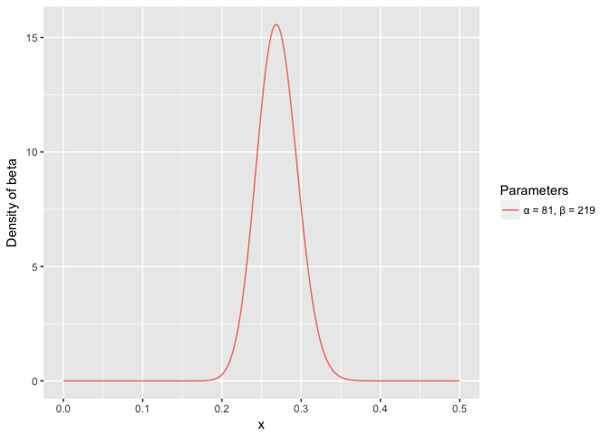
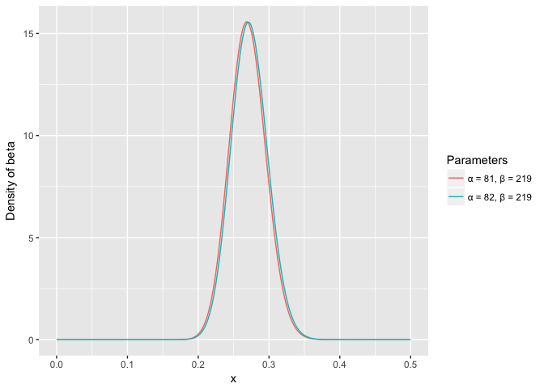
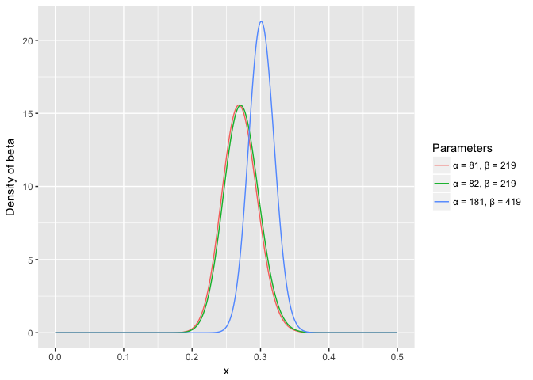

# Understanding the Beta Distribution

This post and the following posts are a simplification of a series of posts by [David Robinson](http://varianceexplained.org/statistics/beta_distribution_and_baseball/)

In short, the beta distribution represents a probability distribution of probabilities, when we don't know what the probability is.

For example, in baseball there is a metric known as the batting average and is simply the number of hits divided by the number of times the player goes up to bat. 0.266 is considered the average and anything > 0.3 is considered an excellent one.

Now, we have a player and we want to predict his batting average. We could use just use his batting average so far, but this will be a poor measure at the start of a season. A player may have missed (batting average: 0.0) or hit (batting average: 1.0) all of the pitches at him. You would expect the batting average to converge towards the mean over the course of the season, but this measure should not be used at the start of a season. 

Why is it a poor measure at the beginning of a season? If a player hits all of the pitches at him why can't we predict he will do it all season? This is because we are using prior expectations. We have historical data showing the batting average is somewhere between 0.215 and 0.360 for a given player.

Given the historical data we have on the players (in statistics known as the prior) we can represent this with a beta distribution. This distribution can give us a rough estimate of the players batting average before he as even taken a swing!

We expect that the player’s season-long batting average will be most likely around .27, but that it could reasonably range from .21 to .35. This can be represented with a beta distribution with parameters $\alpha = 81$ and $\beta = 219$ (calculation of alpha and beta will be in another post):


```r
library(ggplot2)
library(dplyr)

sim <- data.frame(a = c(81, 82, 81 + 100),
                  b = c(219, 219, 219 + 200)) %>%
    group_by(a, b) %>%
    do(data_frame(x = seq(0, 1, .001), y = dbeta(x, .$a, .$b))) %>%
    mutate(Parameters = paste0("\u03B1 = ", a, ", \u03B2 = ", b)) %>%
    ungroup %>%
    mutate(Parameters = factor(Parameters, levels = unique(Parameters)))
```


```r
sim %>% filter(a == 81) %>%
    ggplot(aes(x, y, color = Parameters)) + geom_line() +
    xlim(0, .5) + ylab("Density of beta")
```

```
## Warning: Removed 500 rows containing missing values (geom_path).
```

<!-- -->


Why these paramaters I hear you ask: $\frac{\alpha}{\alpha + \beta}  = \frac{81}{81+219} = 0.27$. Mother of god that's the mean!

The y-axis in this instance is a probability density and the x-axis is as well (batting average is just a probability of a hit after all). The beta distribution represents a probability distribution of probabilities.

Why choose a beta distribution? Imagine a player goes up to bat and hits the ball, his batting average is $1/1 = 1$. We now need to update the distribution which is achieved by:
$$  Beta(\alpha_0 + hits, \beta_0 + misses) $$
$\alpha_0$ and $\beta_0$ are the original parameters (81, 219 respectively). In this case $\alpha$ will increase by 1 and $\beta$ will remain the same since the player did not miss the ball ($Beta(81 + 1, 219 + 0)$). If we now update the beta distribution to reflect this change i.e. shift the red curve over we get something like below.


```r
sim %>% filter(a < 100) %>%
    ggplot(aes(x, y, color = Parameters)) + geom_line() +
    xlim(0, .5) + ylab("Density of beta")
```

```
## Warning: Removed 1000 rows containing missing values (geom_path).
```

<!-- -->

This hardly moved the line! That's because one hit does not really mean anything!

If this player continued this great form, the shift in the curve will be greater, to accommodate this new evidence. The curve will also narrow due to an increased amount of evidence. Let's say now he goes up to bat 300 time and hits 100 of them. The new distribution would look like $Beta(81 + 100, 219 + 200)$:


```r
sim %>% ggplot(aes(x, y, color = Parameters)) + geom_line() +
    xlim(0, .5) + ylab("Density of beta")
```

```
## Warning: Removed 1500 rows containing missing values (geom_path).
```

<!-- -->

The curve is now thinner and shifted to the right!

If we want to we can now estimate the value of the beta distribution ($\frac{\alpha}{\alpha + \beta}$)

Thus, after 100 hits and 300 at-bats, the expected value of the new beta distribution is: $\frac{81+100}{82+100+219+200} = 0.303$. Notice how this is lower than the naive estimate $\frac{100}{100+200} = 0.333$ but higher than the estimate you started of the season with ($\frac{81}{81+219} = 0.270$)

Thus, the beta distribution is best for representing a probabilistic distribution of probabilities- the case where we don’t know what a probability is in advance, but we have some reasonable guesses.


